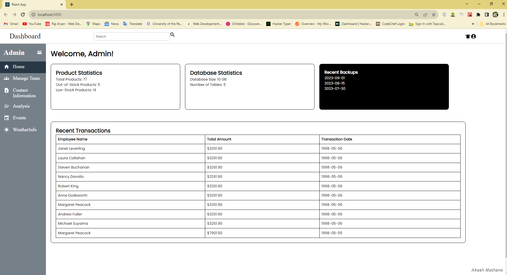

# Fullstack Dashboard

<p align="center">
  
  
  
  
  
</p>

## Overview

Welcome to the Fullstack Dashboard! 🚀 This dynamic admin dashboard showcases my skills in full-stack development, data visualization, and database management. 
It's a powerful tool for monitoring and managing various aspects of your business, leveraging the Northwind database as a data source.

## Key Skills Demonstrated

- **Full-Stack Development:** I've implemented both frontend and backend components using JavaScript, CSS, React, Python, and Flask.

- **Database Management:** The project integrates with a PostgreSQL database and also includes the Northwind SQL file for reference.

- **Data Visualization:** I've incorporated interactive charts (sales line chart, pie chart) to make data analysis a breeze.

- **Event Management:** Use the built-in calendar to track and create events effortlessly.

- **Team Management:** Manage team information efficiently within the dashboard.

- **Weather Information:** Access real-time weather data for any city by simply searching its name.

## Getting Started

1. Clone this repository to your local machine.
2. Set up your own PostgreSQL database and configure the Flask backend.
3. Install the required dependencies for both the frontend and backend.
4. Launch the project to access the admin dashboard.

## Northwind Database

The Northwind database is included in this repository as `northwind.sql`. You can use this SQL file to set up and populate your own Northwind database for testing and development purposes.

```bash
# Example command to import the Northwind database using PostgreSQL's psql command-line tool
psql -U your_username -d your_database_name -a -f northwind.sql
